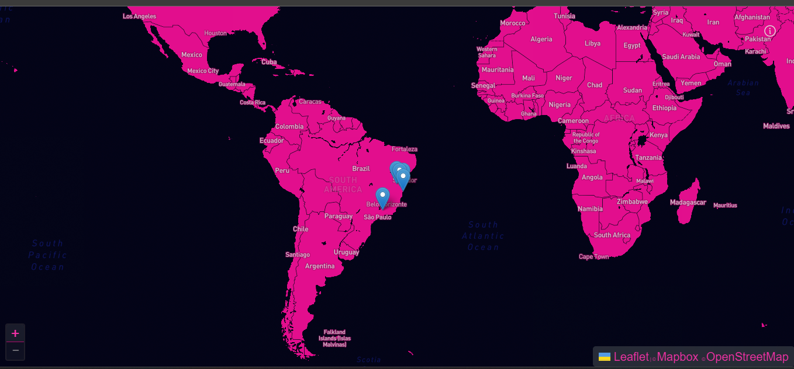

# My Trips

This is a simple page/PWA that shows the places I already went
and shows some pictures and a description when You click it.

## Preview 👁

Access Here - [My Trips](https://my-trips-hemerson-git.vercel.app)  

## Technologies 💻

Next.JS 
Styled-components 
GraphQL + GraphCMS 
ReactJS 
Jest 
Leaflet + Mapbox 

## Running 🏃

1. Clone the project on your computer
2. Open the command prompt
3. Run `cd my-trips && npm install` or `cd my-trips && yarn`
4. Run `npm run dev` or `yarn dev`
5. Access `http://localhost:3000` on your browser
